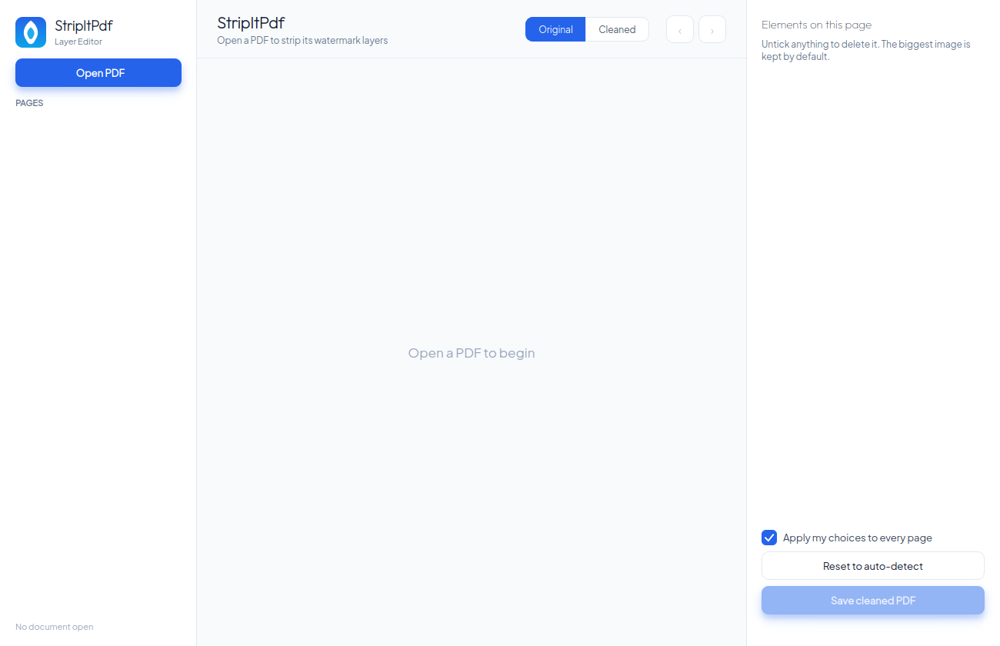

# StripItPdf

A clean, native desktop app that **removes the useless layers stacked on top of a
PDF's page image** — diagonal watermarks, tiled stamps, logos, optional-content
groups, and full-page transparent watermark sheets — keeping the content image
and the real, selectable text.



## Download / install

Pre-built packages are produced by CI (push a `v*` tag) and the Linux ones can be
built locally — see **[packaging/README.md](packaging/README.md)**.

| OS | Get | Run |
|---|---|---|
| **Debian/Ubuntu** | `stripitpdf_*_amd64.deb` | `sudo apt install ./stripitpdf_*.deb` → launch *StripItPdf* |
| **Other Linux** | `stripitpdf-*-linux-x86_64.tar.gz` | `./run.sh` (needs Qt6 runtime) |
| **Windows** | `stripitpdf.exe` + DLLs (zip) | unzip, double-click the exe |
| **macOS** | `stripitpdf.app` (zip/dmg) | drag to Applications |

**No installer is required on any platform** — the `.deb`, the zipped `.app`, and
the zipped exe folder are self-contained. Details + the reasoning in
[packaging/README.md](packaging/README.md).

## Build from source

```bash
# Debian/Ubuntu
sudo apt install cmake g++ qt6-base-dev libmupdf-dev
cmake -S app -B build && cmake --build build -j && ./build/stripitpdf
```
No root? Bootstrap a local Qt6+MuPDF SDK and use the Makefile:
```bash
scripts/bootstrap_sdk.sh && ./app/run.sh
```
Windows (MSYS2) and macOS (brew) build lines are in [packaging/README.md](packaging/README.md).

## Layout

| Path | What |
|---|---|
| `app/` | the C++/Qt6 application (engine `PdfCore`, UI `MainWindow`/`PageView`) — see [app/README.md](app/README.md) |
| `packaging/` | `.deb` / tarball scripts, build artifacts, distribution docs |
| `.github/workflows/build.yml` | CI building Windows/macOS/Linux on native runners |
| `scripts/bootstrap_sdk.sh` | fetch Qt6+MuPDF dev headers without root |
